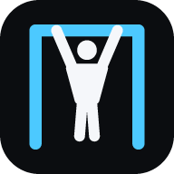

# Training

PWA mobile-first per seguire al parco la scheda settimanale di calisthenics: timer, contatori,
semaforo del gomito, diario e riepilogo della settimana. Funziona offline dopo il primo
caricamento.

**App:** <https://indjiwr.github.io/Training/>

Stack: React + Vite + TypeScript + [vite-plugin-pwa](https://vite-pwa-org.netlify.app/), validazione
con [zod](https://zod.dev/). Nessun backend: la scheda arriva da Google Drive tramite un piccolo
Google Apps Script.

## Indice

- [Funzionalità](#funzionalità)
- [Requisiti](#requisiti)
- [Avvio rapido](#avvio-rapido)
- [Script npm](#script-npm)
- [Pubblicazione su GitHub Pages](#pubblicazione-su-github-pages)
- [Installare l'app sul telefono](#installare-lapp-sul-telefono)
- [Scheda da Google Drive (Apps Script)](#scheda-da-google-drive-apps-script)
- [Formato della scheda](#formato-della-scheda)
- [Offline](#offline)
- [Dati e backup](#dati-e-backup)
- [Struttura del progetto](#struttura-del-progetto)
- [Test](#test)
- [Privacy](#privacy)

## Funzionalità

- **Oggi**: apre il giorno della scheda con la data di oggi (fuso `Europe/Rome`) o, se non c'è,
  il prossimo in programma; un selettore porta agli altri giorni. In testa: dove, cosa portare,
  durata e note. Esercizi nell'ordine della scheda con badge **TEST**, quelli da fare a casa
  raggruppati in fondo sotto «A casa», card di riscaldamento espandibili.
- **Un controllo per ogni tipo di esercizio**:
  - ripetizioni: contatore +/− per serie, precompilato con il massimo dell'obiettivo;
  - tenute: 3-2-1, poi conteggio in avanti con la fascia obiettivo evidenziata; un tocco ferma e
    salva i secondi;
  - tempo: conto alla rovescia con pausa;
  - distanza: spunta per serie;
  - tentativi/massimali: un valore per tentativo (cronometro per i secondi, numero per cm,
    ripetizioni o dolore 0-10), con il migliore evidenziato;
  - `%max`: ripetizioni calcolate dall'ultimo massimale registrato;
  - esercizi per lato: dx e sx per ogni serie.
- **Recupero**: il timer parte da solo dopo ogni serie, mostra l'intervallo e un pulsante +30″
  quando la scheda prevede un recupero variabile; a fine recupero beep e vibrazione (disattivabili).
  Lo schermo resta acceso durante la sessione (Wake Lock, dove supportato).
- **Semaforo del gomito**: nei giorni con il check del gomito chiede subito un punteggio 0-10 e
  adatta la sessione (verde / giallo / rosso), con banner delle regole e override manuale; la regola
  di stop è sempre visibile.
- **Diario**: per sessione RPE (1-10), dolore al gomito durante (0-10) e note; per ogni giorno,
  riposo compreso, peso al mattino (kg), gomito la mattina dopo (0-10) e ore di sonno; risultati dei
  test.
- **Riepilogo settimana**: testo in italiano pronto per il check-in della domenica (sessioni fatte,
  parziali o saltate con serie fatte/previste, risultati dei test, gomito massimo con semaforo, peso
  e sonno medi, note) con pulsante **Copia**.
- **Video ed Esercizi**: pulsante «Video» su ogni esercizio, che di default apre una ricerca
  YouTube; per ogni esercizio puoi fissare un link YouTube (riprodotto incorporato con youtube-nocookie, anche con
  tempo di inizio) o un'immagine/GIF. La pagina **Esercizi** mostra tutta la libreria con i media
  fissati.
- **Backup**: esportazione e importazione di tutti i dati in JSON.
- Interfaccia in italiano, pensata per l'uso con una mano: pulsanti grandi, tema scuro ad alto
  contrasto e tema chiaro «Sole» per la luce diretta.

## Requisiti

- [Node.js](https://nodejs.org/) **22.12 o superiore** (con npm).
- Per l'installazione come app e l'offline serve HTTPS (o `localhost`).

## Avvio rapido

```bash
npm ci
npm run dev
```

Apri <http://localhost:5173>. Per provare subito senza Apps Script, in **Impostazioni** importa un
file di scheda, ad esempio `scheda-corrente.json`.

**Sul telefono, nella stessa rete Wi-Fi:**

```bash
npm run dev -- --host
```

e apri dal telefono l'indirizzo «Network» stampato da Vite (es. `http://192.168.1.20:5173`).

> Il service worker (offline e installazione) esiste solo nella build, non in `npm run dev`:
>
> ```bash
> npm run build && npm run preview -- --host
> ```
>
> Fuori da `localhost` però il browser attiva service worker e Wake Lock solo su **HTTPS**: da un
> indirizzo `http://192.168.…` l'app si usa ma non si installa e non va offline. Il modo più semplice
> per provare la PWA completa sul telefono è [GitHub Pages](#pubblicazione-su-github-pages).

## Script npm

| Comando              | Cosa fa                                                                   |
| -------------------- | ------------------------------------------------------------------------- |
| `npm run dev`        | Server di sviluppo Vite con ricaricamento a caldo.                        |
| `npm run build`      | Controllo dei tipi (`tsc -b`) e build di produzione in `dist/`, con manifest e service worker. |
| `npm run preview`    | Serve la build di `dist/` in locale (porta 4173).                         |
| `npm test`           | Esegue i test vitest una volta.                                           |
| `npm run test:watch` | Test vitest in modalità watch.                                            |
| `npm run typecheck`  | Solo controllo dei tipi (`tsc -b`).                                       |
| `npm run icons`      | Rigenera icone PWA e favicon in `public/` (`scripts/gen-icons.mjs`, solo Node, nessuna dipendenza). |

## Pubblicazione su GitHub Pages

Repository: [IndjiWR/Training](https://github.com/IndjiWR/Training) → <https://indjiwr.github.io/Training/>

1. Una volta sola: **Settings → Pages → Build and deployment → Source: «GitHub Actions»**.
2. Ogni push su `main` avvia il workflow [`Deploy to GitHub Pages`](.github/workflows/deploy.yml)
   (si può lanciare anche a mano da **Actions → Deploy to GitHub Pages → Run workflow**), che esegue
   `npm ci`, `npm test`, `npm run build` e pubblica `dist/`.

Il workflow compila con `BASE_PATH=/<nome-repo>/` (`/Training/`), ricavato in automatico dal nome
del repository: se lo rinomini, il percorso si aggiorna da solo. L'app usa il routing con hash
(`#/oggi`, `#/esercizi`, …), quindi non serve un `404.html` di fallback.

**Base path configurabile** per altri hosting (default `/`; le barre iniziale e finale vengono
aggiunte se mancano):

```bash
BASE_PATH=/altro/ npm run build
```

```powershell
$env:BASE_PATH='/altro/'; npm run build
Remove-Item Env:BASE_PATH   # la variabile resta nella sessione di PowerShell
```

In Git Bash su Windows usa `MSYS_NO_PATHCONV=1 BASE_PATH=/altro/ npm run build`: senza
`MSYS_NO_PATHCONV=1` la shell trasforma `/altro/` in un percorso Windows.

## Installare l'app sul telefono

Apri <https://indjiwr.github.io/Training/> con la connessione attiva, poi:

- **Android (Chrome)**: menu **⋮ → «Installa app»** (o «Aggiungi a schermata Home»).
- **iPhone (Safari)**: **Condividi → «Aggiungi alla schermata Home»**.

Dopo il primo caricamento l'app funziona anche senza rete. Su iPhone l'app installata ha dati
separati da Safari: configura l'endpoint (o importa il backup) dall'app installata. Safari su
iPhone non supporta la vibrazione: resta il beep.

Il service worker è in modalità *prompt*: una nuova versione pubblicata non ricarica mai la pagina
da sola, così non interrompe un allenamento in corso.

## Scheda da Google Drive (Apps Script)

Ogni domenica la nuova scheda viene salvata in una cartella di Google Drive come
`scheda-AAAA-MM-GG.json`; la più recente è quella corrente. Lo script
[`apps-script/Code.gs`](apps-script/Code.gs) restituisce come JSON il file più recente della
cartella il cui nome rispetta `^scheda-\d{4}-\d{2}-\d{2}\.json$` (ordinati per nome); senza il
token giusto risponde `{"error":"unauthorized"}`.

Configurazione (guida passo passo in [`apps-script/README.md`](apps-script/README.md)):

1. Crea un progetto su [script.google.com](https://script.google.com/) e incolla `Code.gs`.
2. In **Impostazioni progetto → Proprietà script** aggiungi `FOLDER_ID` (l'ID della cartella Drive,
   la parte finale del suo URL) e `TOKEN` (una stringa casuale lunga).
3. **Esegui il deployment → Nuovo deployment → App web**, con *Esegui come: Me* e *Chi ha accesso:
   Chiunque* (in inglese *Execute as: Me*, *Who has access: Anyone*); autorizza l'accesso a Drive e
   copia l'URL che termina con `/exec`.
4. Nell'app, in **Impostazioni**, incolla l'URL `/exec` e il token, poi tocca **Aggiorna scheda**.

L'app scarica la scheda con una GET semplice, senza header personalizzati (Apps Script non risponde
al preflight CORS), passando il token come parametro `?token=`. Senza endpoint resta sempre
disponibile l'importazione manuale di un file JSON da **Impostazioni**.

> **Sicurezza**: l'URL dell'endpoint e il token non sono mai nel repository. Vivono solo sul
> dispositivo (localStorage) e sono esclusi dai backup.

## Formato della scheda

Il contratto è [`scheda-corrente.json`](scheda-corrente.json), una scheda reale usata sia come
esempio sia come fixture dei test, descritta dallo schema zod in
[`src/plan/schema.ts`](src/plan/schema.ts) (`schema: 1`). Il formato è dato: è l'app ad adattarsi.

| Campo                | Contenuto                                                                                   |
| -------------------- | ------------------------------------------------------------------------------------------- |
| radice               | `schema` (1), `id`, `generated_at` (data/ora ISO), `cycle`, `week`, `title`, `period`, `start`, `end`, `next_checkin`, `goals`, `elbow`, `warmups`, `library`, `days`, `tests` |
| `days[]`             | `date` (ISO), `weekday`, `type` (`TIRATA` \| `SPINTA` \| `GAMBE` \| `RIPOSO`), `title`, `where`, `bring`, `duration`, `note`, `exercises[]` |
| `exercises[]`        | `n`, `key`, `block`, `name`, `dose` (testo da mostrare), `kind` (`reps` \| `hold` \| `time` \| `distance` \| `attempts` \| `max` \| `info`), `sets`/`sets_max`, `target_min`/`target_max`, `unit` (`rep` \| `s` \| `min` \| `m` \| `%max` \| `cm`), `per_side`, `rest` (testo), `rest_s`/`rest_max_s` (`null` = recupero libero), `note`, `test`, `home` |
| `library[key]`       | `label`, `measure` (unità del risultato; `"0-10"` = dolore), `video_query`, `hanging`, `on_yellow` (`skip` \| `halve`) |
| `warmups[key]`       | chiavi `riscaldamento-*`: `title`, `items[]` (`name`, `dose`, `note`)                        |
| `elbow`              | `green_max`, `yellow_max`, `rules` (`green`, `yellow`, `red`, `stop`)                        |
| `tests[]`            | `name`, `unit`, `value`, `when`, `note`                                                     |

Molti campi possono essere `null` o mancare. Se una scheda non rispetta il formato, l'app mostra un
errore chiaro (campo per campo) e continua a usare la scheda già salvata.

**Come la usa l'app**

- **Giorno**: quello con la data di oggi nel fuso `Europe/Rome`; altrimenti il prossimo in
  programma (se la scheda è tutta passata, l'ultimo giorno).
- **Semaforo del gomito** (punteggio 0-10 chiesto prima di tutto nei giorni che contengono
  l'esercizio `check-gomito`):
  - 🟢 **verde** se ≤ `green_max`: sessione invariata;
  - 🟡 **giallo** se ≤ `yellow_max`: gli esercizi con `library.hanging = true` seguono
    `on_yellow`: `skip` li nasconde, `halve` dimezza le serie arrotondando per eccesso;
  - 🔴 **rosso** sopra `yellow_max`: tutti gli esercizi in sospensione sono nascosti.

  Un banner mostra il testo di `elbow.rules` per il livello; il semaforo si può cambiare a mano
  (override) e la regola `stop` è sempre visibile nel dialogo del check. Se la scheda non ha
  `elbow`, valgono le soglie 3 e 5.
- **`%max`**: ripetizioni = round(percentuale × ultimo massimale registrato per la stessa `key`);
  se non c'è ancora un massimale, si vede il testo di `dose`.
- **Scheda più recente**: una scheda scaricata sostituisce quella salvata solo se il suo
  `generated_at` è successivo; in quel caso compare un avviso.

## Offline

- Dopo il primo caricamento il service worker mette in cache tutta l'app (HTML, JS, CSS, icone):
  al parco funziona senza segnale.
- L'ultima scheda valida resta salvata sul dispositivo.
- La scheda si aggiorna da sola all'apertura e quando torna la connessione, oltre che con
  **Aggiorna scheda**. Se il download fallisce resta quella in cache.
- Le immagini/GIF fissate vengono conservate in cache dopo la prima visualizzazione; i video
  YouTube richiedono la rete.

## Dati e backup

Sessioni, diario, scheda, media fissati e impostazioni restano nel `localStorage` del browser,
solo su questo dispositivo: cancellando i dati del sito si perdono.

- **Esporta** da **Riepilogo** o **Impostazioni**: scarica `training-backup-AAAA-MM-GG.json` con
  tutti i dati, media fissati compresi (ma senza URL dell'endpoint e token).
- **Importa** lo stesso file per ripristinare i dati, ad esempio su un altro telefono; il file
  viene validato prima di sostituire i dati attuali.

## Struttura del progetto

```text
├── apps-script/          Code.gs e guida al deploy della Web app
├── public/               icone PWA e favicon (generate da scripts/gen-icons.mjs)
├── scripts/              gen-icons.mjs: encoder PNG e rasterizzatore in puro Node
├── src/
│   ├── plan/             schema zod della scheda (contratto + validazione)
│   ├── lib/              logica pura: date, gomito, risultati e %max, riepilogo, sync, backup,
│   │                     media, suoni/vibrazione, wake lock
│   ├── state/            store su localStorage, azioni, stato UI (avvisi, timer di recupero),
│   │                     sincronizzazione della scheda
│   ├── components/       UI condivisa, icone, timer, esercizi, media, shell e navigazione
│   ├── screens/          Oggi, Esercizi, Riepilogo, Impostazioni
│   └── styles/           token e primitive CSS
├── scheda-corrente.json  scheda reale: esempio e fixture dei test
└── vite.config.ts        Vite + PWA (manifest, service worker, BASE_PATH)
```

## Test

```bash
npm test
```

Test [vitest](https://vitest.dev/) (`src/**/*.test.ts`) che usano `scheda-corrente.json` come
fixture. Coprono: logica del semaforo del gomito, trasformazioni giallo/rosso, calcolo `%max`,
riepilogo settimanale, validazione della scheda, scelta del giorno (fuso `Europe/Rome`),
sincronizzazione (URL, errori, scheda più recente), backup e parsing dei link media. Il workflow di deploy esegue i test prima di ogni build.

## Privacy

Il repository è **pubblico**. `scheda-corrente.json` è la scheda reale (con alcuni dati personali
di allenamento), usata come esempio e fixture dei test. Nel repository non ci sono URL
dell'endpoint, token né dati del diario: restano sul dispositivo.
